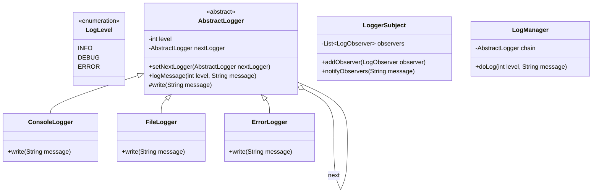

# Log Framework

## 1. Problem Statement & Company Tags

**Problem:** Design a flexible logging framework (like Log4j or Slf4j) that can log messages with different severity levels (DEBUG, INFO, ERROR) to various output destinations (Console, File, Database). The framework should allow configuring which log levels go to which sinks.

**Company Tags:** `Microsoft` `Salesforce` `Atlassian` `Apple`

---

## 2. Requirement Clarification

### Functional Requirements

1.  **Log Levels:** Support generic levels: `INFO`, `DEBUG`, `ERROR`.
2.  **Destinations (Sinks):** Support logging to **Console**, **File**, and potentially **Database**.
3.  **Filtering:** Messages should flow through a chain. For example, if configured for INFO, it should log INFO and ERROR, but not DEBUG.
    - _Correction/Common approaches:_
      - **Standard Level Hierarchy:** DEBUG < INFO < ERROR. Setting level to INFO means we log INFO and ERROR.
      - **Chain of Responsibility:** Each logger in the chain decides if it can handle the message level.

### Non-Functional Requirements

1.  **Performance:** Asynchronous logging (optional but good for SDE-3) to avoid blocking the main thread.
2.  **Extensibility:** Easy to add new sinks (e.g., CloudWatch) or new levels.
3.  **Singleton:** The Logger instance should likely be a Singleton or managed globally.

---

## 3. The Seniority Perspective

### SDE-1 Focus: Basic Interfaces

- **Focus:** Define the `Logger` interface and basic `ConsoleLogger`.
- **Goal:** Ensure messages are printed with timestamps and levels.

### SDE-2 Focus: Design Patterns (Chain of Responsibility)

- **Focus:** How to handle different levels dynamically?
- **Pattern:** **Chain of Responsibility**. Create an abstract `Logger` class.
  - `InfoLogger` handles INFO.
  - `ErrorLogger` handles ERROR.
  - `DebugLogger` handles DEBUG.
  - They are chained: `ErrorLogger` -> `InfoLogger` -> `DebugLogger` (or widely configured).
- **Alternative:** **Observer Pattern** for Sinks. When a log is generated, notify all attached sinks (Console vs File).

### SDE-3 Focus: Performance & Configuration

- **Focus:** Logging is high-volume. Writing to file/DB is slow.
- **Solution:** **Asynchronous Logging** using a Message Queue (Producer-Consumer) or `BlockingQueue`. The `log()` method puts the message in a queue, and a background thread writes to sinks.
- **Feature:** **Sink Management**. Configuring multiple sinks for the same logger.

---

## 4. Class Diagram

_(Note: In the implementation, we will combine Chain (for filtering levels) and Sinks (for output).)_

---

## 5. Core Logic Implementation

The implementation is provided in the `src/` directory.

### Key Highlights

- **Chain of Responsibility:** `AbstractLogger` checks `this.level`. If message level >= `this.level`, it writes. Then it calls `nextLogger.logMessage()`.
- This allows a hierarchy (e.g., Error Logger checks for ERROR; then passes to File Logger which checks for INFO, etc).

---

## 6. Evaluation Against SOLID Principles

| Principle                 | Adherence in this Solution                                                                                        |
| :------------------------ | :---------------------------------------------------------------------------------------------------------------- |
| **S**ingle Responsibility | `ConsoleLogger` only writes to console. `AbstractLogger` handles flow control.                                    |
| **O**pen/Closed           | New loggers (e.g., `DatabaseLogger`) can be added by extending `AbstractLogger` without modifying the core logic. |
| **L**iskov Substitution   | Any subclass of `AbstractLogger` can replace the parent in the chain.                                             |
| **I**nterface Segregation | Not heavily used here, but `Logger` interface helps.                                                              |
| **D**ependency Inversion  | `LogManager` depends on `AbstractLogger`, not concrete `ConsoleLogger`.                                           |
