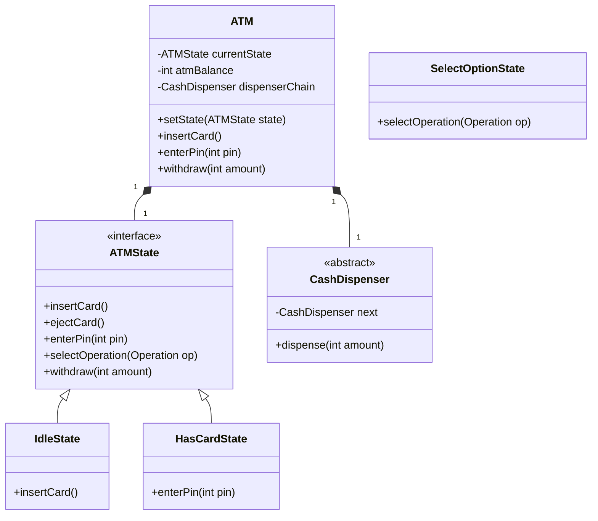

# ATM Machine

## 1. Problem Statement & Company Tags

**Problem:** Design the software for an ATM Machine. The system needs to support operations like Balance Inquiry, Cash Withdrawal, and Pin Change. It must handle different states (Idle, Card Inserted, Transaction) and manage cash dispensing using the Chain of Responsibility pattern.

**Company Tags:** `Google` `Amazon` `Visa` `Paytm` `Morgan Stanley`

---

## 2. Requirement Clarification

### Functional Requirements

1.  **Authentication:** User inserts card and Enters PIN.
2.  **Operations:** View Balance, Withdraw Cash, Deposit Cash (optional).
3.  **Dispensing:** ATM has limited cash in denominations (2000, 500, 100).
4.  **State Management:** Transaction can be cancelled at any step.

### Non-Functional Requirements

1.  **Concurrency:** Critical. ACID properties for transaction.
2.  **Security:** Mask PIN, timeouts.
3.  **State Safety:** Cannot double-dip/withdraw.

---

## 3. The Seniority Perspective

### SDE-1 Focus: Class Interaction

- **Focus:** Entities `ATM`, `Card`, `Account`, `BankService`.
- **Goal:** Basic withdraw flow works.

### SDE-2 Focus: Design Patterns (State & Chain)

- **Pattern:** **State Pattern**. `ATMState` interface: `IdleState`, `HasCardState`, `SelectOptionState`, `CashWithdrawalState`.
- **Pattern:** **Chain of Responsibility**. `CashDispenser`. `TwoThousandDispenser` -> `FiveHundredDispenser` -> `OneHundredDispenser`.

### SDE-3 Focus: Concurrency & Hardware

- **Focus:** What if power fails during dispense?
- **Design:** **Two-Phase Commit** or Transaction Logs.

---

## 4. Class Diagram

---

## 5. Core Logic Implementation

### Key Highlights

- **State Pattern:** Operations throw errors if called in wrong state (e.g., withdrawing cash when Idle).
- **Chain of Responsibility:** Detailed recursion for 2000 -> 500 -> 100.

---

## 6. Evaluation Against SOLID Principles

| Principle                 | Adherence in this Solution                                                    |
| :------------------------ | :---------------------------------------------------------------------------- |
| **S**ingle Responsibility | States handle transitions, Dispensers handle cash math.                       |
| **O**pen/Closed           | Add new State (e.g. `DepositState`) or new Note (e.g. `200Dispenser`) easily. |
| **L**iskov Substitution   | All States follow `ATMState` contract (though throw exceptions).              |
