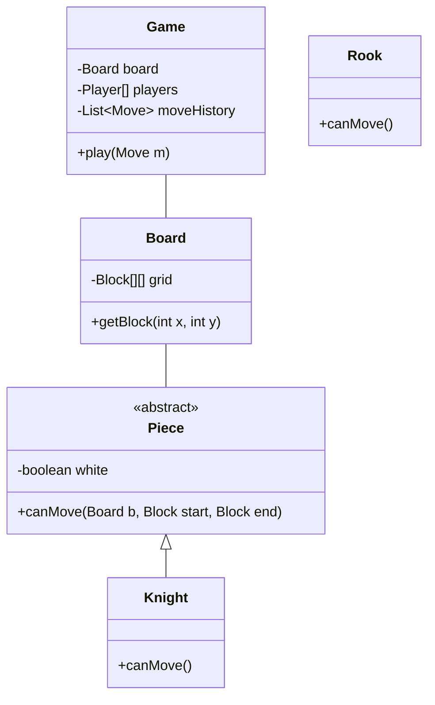

# Chess Game

## 1. Problem Statement & Company Tags

**Problem:** Design a 2-player Chess game. It should ensure valid moves for each piece (Pawn, Rook, Knight, etc.), detect Check/Checkmate, and manage game state.
**Company Tags:** `Google` `Meta` `Microsoft` `Amazon`

---

## 2. Requirement Clarification

### Functional Requirements

1.  **Board:** 8x8 Grid.
2.  **Pieces:** King, Queen, Rook, Bishop, Knight, Pawn.
3.  **Movement:** Valid moves per piece type.
4.  **Game Flow:** Turn-based (White -> Black).
5.  **Win Condition:** Checkmate or Resignation.

### Non-Functional Requirements

1.  **Extensibility:** Easy to add new variants (e.g., Suicide Chess).
2.  **Modular:** Board, Pieces, and Game Logic should be separate.

---

## 3. The Seniority Perspective

### SDE-1 Focus: OOP

- **Focus:** `Piece` abstract class, `Board` class.
- **Goal:** Implementing `isValidMove()` for Knight/Rook.

### SDE-2 Focus: Design Patterns

- **Focus:** Extensibility.
- **Pattern:** **Strategy Pattern** for Move Logic or **Command Pattern** for Move History (Undo functionality).
- **Pattern:** **Flyweight Pattern**? Not strictly needed for 32 pieces, but good to mention for "Piece Types".

### SDE-3 Focus: AI & Validation

- **Focus:** "Is King in Check?".
- **Validation:** Validation logic is complex.
  - _Naive:_ Loop every enemy piece to see if they can hit King.
  - _Optimized:_ Bitboards (too low level for LLD).
  - **Architecture:** Separation of `MoveValidator` from `GameController`.

---

## 4. Class Diagram

---

## 5. Trade-offs (SDE-3 Deep Dive)

| Decision            | Option A               | Option B                                | Why we chose B?                                                                                                                                                             |
| :------------------ | :--------------------- | :-------------------------------------- | :-------------------------------------------------------------------------------------------------------------------------------------------------------------------------- |
| **Move Validation** | Inside `Piece` class.  | Separate `MoveValidator` class.         | **Inside Piece (for standard Chess)**. The logic is intrinsic to the piece. However, "Check" logic belongs in the `Board` or `Game` class because it involves global state. |
| **Undo Storage**    | Store full board copy. | Store `Move` command (Command Pattern). | **Command Pattern**. Storing difference (delta) is memory efficient and allows infinite undo/redo.                                                                          |

---
## 6. Anti-Patterns (What NOT to do)
### ❌ 1. God Class 'Board'
*   **Bad:** The Board class validating every move for every piece type.
*   **Why:** Board becomes 2000 lines long.
*   **Fix:** **Polymorphism**. Piece.validateMove() handles its own logic.

### ❌ 2. Storing State in strings
*   **Bad:** String board[][] = new String[8][8]; "K", "Q", "p".
*   **Why:** String parsing is slow and error-prone.
*   **Fix:** Use Object-Oriented Cell and Piece objects.
