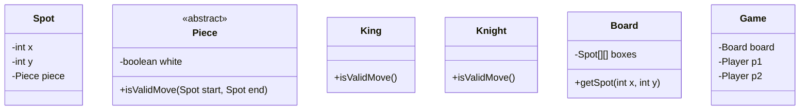

# Chess UML

```mermaid
classDiagram
    class Spot {
        -int x
        -int y
        -Piece piece
    }

    class Piece {
        <<abstract>>
        -boolean white
        +isValidMove(Spot start, Spot end)
    }

    class King { +isValidMove() }
    class Knight { +isValidMove() }

    class Board {
        -Spot[][] boxes
        +getSpot(int x, int y)
    }

    class Game {
        -Board board
        -Player p1
        -Player p2
    }
```
