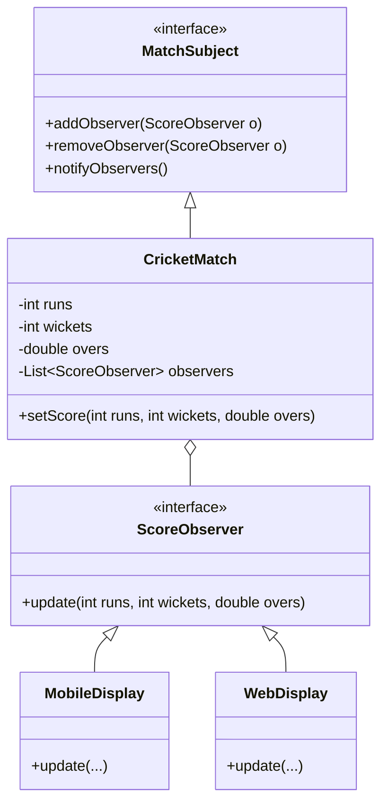

# CricInfo (Live Cricket Dashboard)

## 1. Problem Statement & Company Tags

**Problem:** Design a system like CricInfo or Cricbuzz to display live cricket scores. The system must notify multiple displays (Mobile App, Website, LED Board) whenever the score changes.

**Company Tags:** `Cricbuzz` `Dream11` `Hotstar` `ESPN`

---

## 2. Requirement Clarification

### Functional Requirements

1.  **Match Data:** Tracks runs, wickets, overs.
2.  **Observers:** Multiple types of displays need real-time updates.
3.  **Updates:** Push mechanism preferred for real-time notifications.

### Non-Functional Requirements

1.  **Latency:** Updates should be near real-time.
2.  **Decoupling:** Adding a new display type (e.g., Apple Watch) should not change the core Match logic.

---

## 3. The Seniority Perspective

### SDE-1 Focus: Basic Interfaces

- **Focus:** `ScoreBoard` class and `Display` interface.
- **Goal:** Simple `update()` method call.

### SDE-2 Focus: Design Patterns (Observer)

- **Pattern:** **Observer Pattern**.
  - `Subject` (Match): Maintains list of observers.
  - `Observer` (Display): Has `update(score)` method.
- **Why?** Decouples the data source from the views.

### SDE-3 Focus: Push vs Pull & Scale

- **Focus:** What if 10 million users are watching?
- **Design:**
  - **Push Model:** Subject sends data in `update(data)`. Good if data is small.
  - **Pull Model:** Subject sends `update()`, Observer calls `subject.getData()`. Better if Observer needs specific data.
  - **Architecture:** Use Message Queues (Kafka) for fan-out in real system.

---

## 4. Class Diagram

---

## 5. Core Logic Implementation

### Key Highlights

- **Observer Pattern:** The `CricketMatch` class iterates through registered observers and calls `update()` whenever `setScore()` is called.

---

## 6. Evaluation Against SOLID Principles

| Principle                 | Adherence in this Solution                                         |
| :------------------------ | :----------------------------------------------------------------- |
| **S**ingle Responsibility | Match manages state, Displays manage rendering.                    |
| **O**pen/Closed           | New displays can be added without modifying `CricketMatch`.        |
| **D**ependency Inversion  | Match depends on `ScoreObserver` interface, not concrete displays. |
