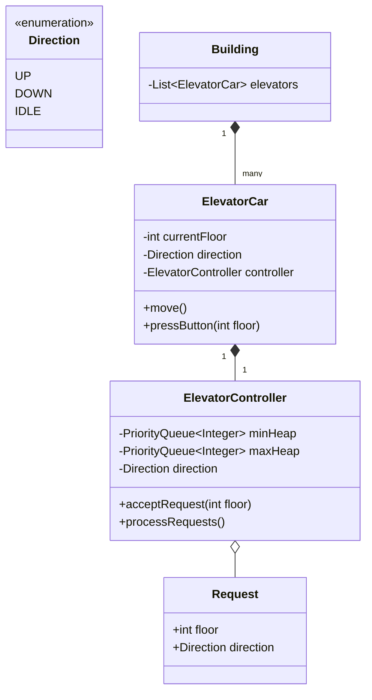

# Elevator System (Smart Lifts)

## 1. Problem Statement & Company Tags

**Problem:** Design a software for an Elevator system in a multi-story building. The system should handle external requests (from floor buttons) and internal requests (from inside the elevator) efficiently using an optimal scheduling algorithm.

**Company Tags:** `Uber` `Microsoft` `Google` `Adobe` `Grab`

---

## 2. Requirement Clarification

### Functional Requirements

1.  **Elevator Car:** Can move Up, Down, or stay Idle.
2.  **Panels:**
    - **External Panel:** Up/Down buttons on each floor.
    - **Internal Panel:** Specific floor buttons inside the car.
3.  **Scheduling:** Efficiently handle requests. Determine which elevator to send (if multiple) and which order to serve floors.
4.  **Capacity:** (Optional) Handle max weight.

### Non-Functional Requirements

1.  **Efficiency:** Minimize wait time. (Use **SCAN / LOOK Algorithm**, not FCFS).
2.  **Safety:** Doors shouldn't open while moving.
3.  **Thread Safety:** Multiple people pressing buttons simultaneously.

---

## 3. The Seniority Perspective

### SDE-1 Focus: Basic State Management

- **Focus:** Can moving the elevator be cleanly modeled?
- **Pattern:** **State Pattern** (MovingUp, MovingDown, Idle).
- **Entities:** `Elevator`, `Request`, `Button`.

### SDE-2 Focus: Scheduling Algorithms

- **Focus:** How to avoid starvation?
- **Algorithm:** **SCAN (Elevator Algorithm)**.
  - Continue in current direction until no more requests, then switch.
  - Or **LOOK**: Like SCAN but reverses direction immediately if no requests further ahead, not necessarily at terminal floor.
- **Design:** `Dispatcher` class that holds queue of `Requests` and assigns them.

### SDE-3 Focus: Concurrency & Multiple Elevators

- **Focus:** 10 Elevators, 100 Floors.
- **Algorithm:** `Dispatcher` needs to select the _best_ elevator.
  - Cost function: `Distance + Direction`.
  - If Elevator A is at Floor 1 going UP, and Request at Floor 5 UP, cost is low.
  - If Elevator B is at Floor 10 going DOWN, cost is high.

---

## 4. Class Diagram

---

## 5. Core Logic Implementation

### Key Highlights

- **Two Priority Queues:**
  - `minHeap`: Stores requests for floors **above** current (when Going UP).
  - `maxHeap`: Stores requests for floors **below** current (when Going DOWN).
- **LOOK Algorithm:**
  - If moving UP: Process `minHeap`.
  - If `minHeap` empty: Change direction to DOWN, process `maxHeap`.

---

## 6. Evaluation Against SOLID Principles

| Principle                 | Adherence in this Solution                                                               |
| :------------------------ | :--------------------------------------------------------------------------------------- |
| **S**ingle Responsibility | `ElevatorCar` moves, `ElevatorController` decides logic.                                 |
| **O**pen/Closed           | New Scheduling Algorithms (e.g. FCFS) can be added by abstracting `Controller` strategy. |
| **L**iskov Substitution   | Subtypes of Elevator (ServiceElevator, PassengerElevator) can be swapped.                |
| **I**nterface Segregation | Panel interfaces separated.                                                              |
| **D**ependency Inversion  | Building depends on abstractions if strict.                                              |

---
## 6. Anti-Patterns (What NOT to do)
### ❌ 1. FCFS Scheduling
*   **Bad:** Servicing requests strictly in arrival order.
*   **Why:** Elevator zig-zags (1 -> 10 -> 2 -> 9). 
*   **Fix:** **SCAN/LOOK Algorithm**. Continues in one direction before switching.

### ❌ 2. Polling for Requests
*   **Bad:** while(true) { checkButtons(); sleep(100); }
*   **Why:** CPU intensive or latent.
*   **Fix:** Use **Observer Pattern** or Event Listeners.
