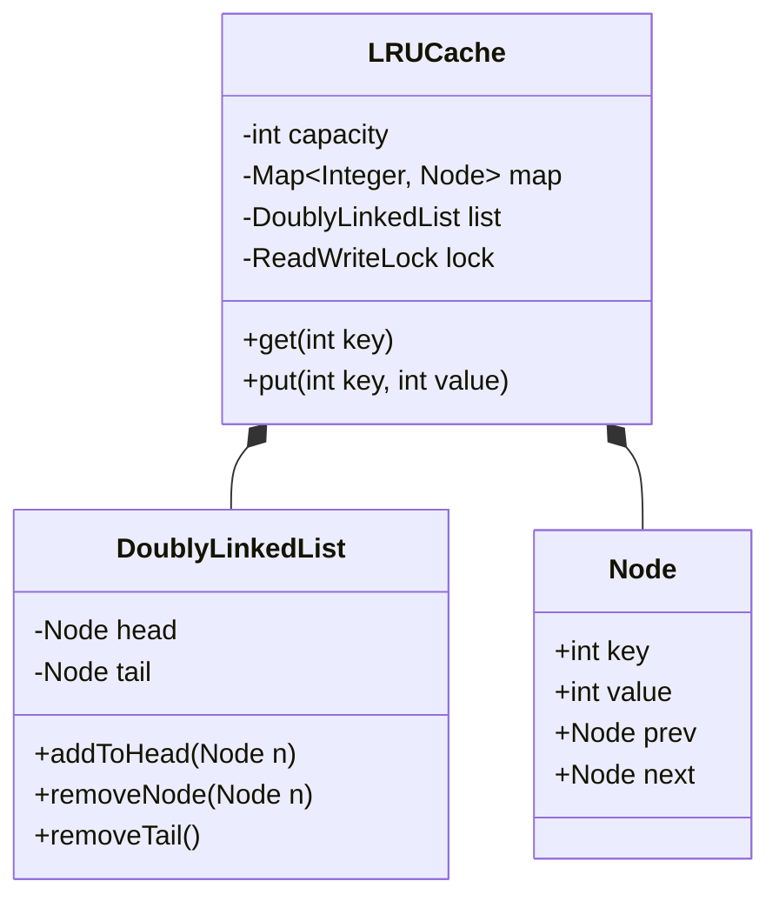

# LRU Cache

## 1. Problem Statement & Company Tags

**Problem:** Design a data structure that follows the strict Least Recently Used (LRU) eviction policy. It must support `get(key)` and `put(key, value)` in **O(1)** time complexity.

**Company Tags:** `Google` `Amazon` `Salesforce` `Microsoft`

---

## 2. Requirement Clarification

### Functional Requirements

1.  **Capacity:** Fixed size.
2.  **Eviction:** Remove least recently used item when full.
3.  **Access:** `get` and `put` constitute access.

### Non-Functional Requirements

1.  **Time Complexity:** O(1) for both `get` and `put`.
2.  **Concurrency:** Must be thread-safe for multiple readers/writers.

---

## 3. The Seniority Perspective

### SDE-1 Focus: Logic

- **Focus:** Can you combine a `HashMap` and a `DoublyLinkedList`?
- **Goal:** Implement the DLL manually (Node class) to show understanding.

### SDE-2 Focus: Clean Code

- **Focus:** Separation of concerns.
- **Pattern:** Wrapper class for the Cache.

### SDE-3 Focus: Concurrency

- **Focus:** **Thread Safety**.
- **Approaches:**
  - `synchronized` methods (Simple, coarse-grained).
  - `ReentrantReadWriteLock` (Better, allow multiple readers, single writer).
  - `ConcurrentHashMap` (Doesn't solve the DLL ordering problem easily).
- **Winner:** Global Lock or ReadWriteLock guarding both Map and DLL.

---

## 4. Class Diagram

---

## 5. Trade-offs (SDE-3 Deep Dive)

| Decision           | Option A                         | Option B                  | Why we chose B?                                                                                                                                                              |
| :----------------- | :------------------------------- | :------------------------ | :--------------------------------------------------------------------------------------------------------------------------------------------------------------------------- |
| **Data Structure** | `LinkedHashMap` (Java Built-in). | Custom `HashMap` + `DLL`. | **Custom**. Interviewers want to see you implement the DLL + Map logic manually to prove O(1) understanding.                                                                 |
| **Locking**        | Lock only the Map.               | Lock Map + List.          | **Lock Both**. The Map and List state must be consistent. If you modify the list (promote to head) but not the map, state is corrupt. We need a lock around the transaction. |
