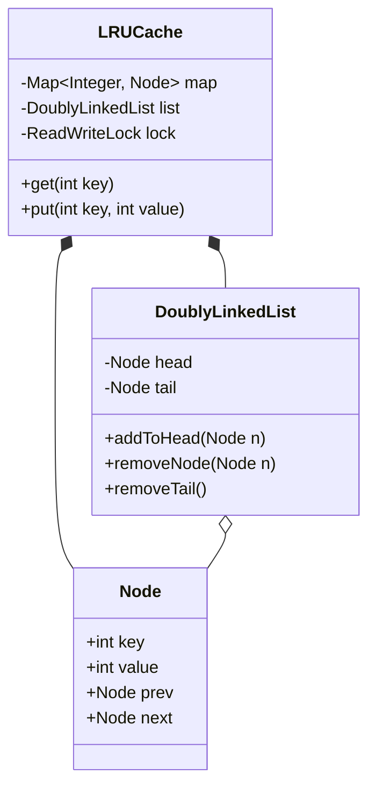

# LRU Cache UML

```mermaid
classDiagram
    class Node {
        +int key
        +int value
        +Node prev
        +Node next
    }

    class DoublyLinkedList {
        -Node head
        -Node tail
        +addToHead(Node n)
        +removeNode(Node n)
        +removeTail()
    }

    class LRUCache {
        -Map~Integer, Node~ map
        -DoublyLinkedList list
        -ReadWriteLock lock
        +get(int key)
        +put(int key, int value)
    }

    LRUCache *-- DoublyLinkedList
    LRUCache *-- Node
    DoublyLinkedList o-- Node
```
