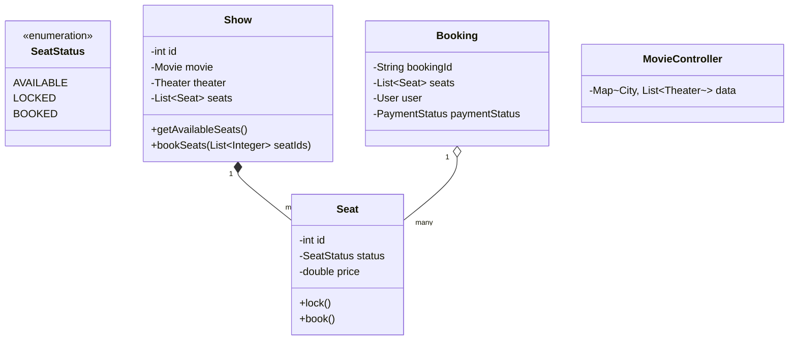

# Movie Ticket Booking System (BookMyShow)

## 1. Problem Statement & Company Tags

**Problem:** Design a Movie Ticket Booking system (like BookMyShow or Fandango). Users should be able to search for movies, view theater shows, and book seats. The critical requirement is ensuring that **no two users can book the same seat** simultaneously.

**Company Tags:** `Flipkart` `Amazon` `BookMyShow` `Paytm`

---

## 2. Requirement Clarification

### Functional Requirements

1.  **Search:** Search by City > Movie > Theater > Show.
2.  **Seat Selection:** View seat map (Available, Booked, Reserved).
3.  **Booking:** Select seats -> Hold seats (Temporary Lock) -> Payment -> Confirm.
4.  **Timeout:** If payment fails or takes too long (> 5 mins), release the lock.

### Non-Functional Requirements

1.  **Concurrency:** High concurrency. Seat locking must be strictly consistent.
2.  **Isolation:** Booking transaction should be ACID.

---

## 3. The Seniority Perspective

### SDE-1 Focus: Data Modeling

- **Focus:** Core entities `Movie`, `Theater`, `Show`, `Seat`, `Booking`.
- **Goal:** Simple flow: search -> select -> book.

### SDE-2 Focus: Extensibility

- **Focus:** Handling discount coupons, dynamic pricing.
- **Pattern:** **Strategy** for Pricing.

### SDE-3 Focus: Concurrency & Distributed Locking

- **Focus:** The "Double Booking" problem.
- **Mechanism:**
  - **Optimistic Locking:** Use a version number on the `Seat` row. Update only if `version` matches.
  - **Pessimistic Locking:** `synchronized` block or `ReentrantLock` in memory (for LLD).
  - **Distributed Lock:** Redis `SETNX` (for System Design, but mention it in LLD).
- **Trade-off:** We will use **synchronized** methods or **Locks** on the `Show` object to handle seat updates.

---

## 4. Class Diagram

---

## 5. Trade-offs (SDE-3 Deep Dive)

| Decision                | Option A                               | Option B                        | Why we chose B?                                                                                                                                                                                               |
| :---------------------- | :------------------------------------- | :------------------------------ | :------------------------------------------------------------------------------------------------------------------------------------------------------------------------------------------------------------ |
| **Locking Granularity** | Lock the entire `Show` object.         | Lock individual `Seat` objects. | **A (Show Level) or Hybrid**. Locking individual seats is complex (deadlock risk if booking [1,2] vs [2,1]). Locking the `Show` for the duration of state check + status update is safer and simpler for LLD. |
| **Lock Expiry**         | Background Thread to check timestamps. | Check validity on read.         | **Background Thread**. We typically need a scheduler to release locks after 5 mins. For this coding solution, we might implement a simplified check.                                                          |

---
## 6. Anti-Patterns (What NOT to do)
### ❌ 1. The 'Double Booking' Bug
*   **Bad:** Checking isSeatFree and ookSeat as separate DB calls.
*   **Why:** Race condition. Two users book the same seat.
*   **Fix:** **Transactions** (ACID) or SELECT ... FOR UPDATE locking.

### ❌ 2. Polling for Payment
*   **Bad:** Client polling server 'is payment done?'.
*   **Fix:** Webhooks or Async Messaging (Kafka/SQS).
