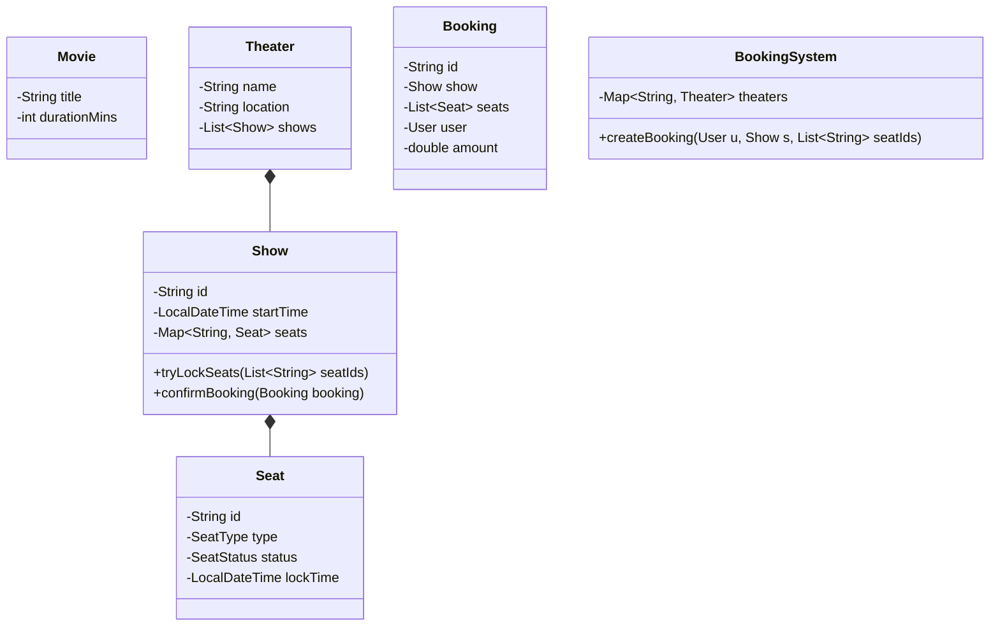

# Movie Ticket Booking UML

```mermaid
classDiagram
    class Movie {
        -String title
        -int durationMins
    }

    class Theater {
        -String name
        -String location
        -List~Show~ shows
    }

    class Show {
        -String id
        -LocalDateTime startTime
        -Map~String, Seat~ seats
        +tryLockSeats(List~String~ seatIds)
        +confirmBooking(Booking booking)
    }

    class Seat {
        -String id
        -SeatType type
        -SeatStatus status
        -LocalDateTime lockTime
    }

    class Booking {
        -String id
        -Show show
        -List~Seat~ seats
        -User user
        -double amount
    }

    class BookingSystem {
        -Map~String, Theater~ theaters
        +createBooking(User u, Show s, List~String~ seatIds)
    }

    Theater *-- Show
    Show *-- Seat
```
