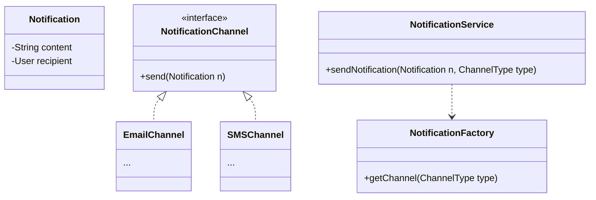

# Notification System

## 1. Problem Statement & Company Tags

**Problem:** Design a Notification System that can send notifications via multiple channels (Email, SMS, Push). It should be pluggable to add new channels and robust to handle failures.

**Company Tags:** `Google` `Amazon` `Swiggy` `Flipkart`

---

## 2. Requirement Clarification

### Functional Requirements

1.  **Channels:** Email, SMS, In-App.
2.  **Input:** Client sends `(User, Message, Type)`.
3.  **Opt-out:** Users can opt-out of specific channels.

### Non-Functional Requirements

1.  **Reliability:** Messages must not be lost (use Queues in real system).
2.  **Extensibility:** Easy to add "WhatsApp" channel.

---

## 3. The Seniority Perspective

### SDE-1 Focus: Interfaces

- **Focus:** `NotificationSender` interface.
- **Goal:** Factory to create `EmailSender`, `SmsSender`.

### SDE-2 Focus: Adapter Pattern

- **Focus:** Integrating 3rd party APIs (SendGrid, Twilio).
- **Pattern:** **Adapter Pattern**. `EmailAdapter` wraps `SendGrid`.

### SDE-3 Focus: Decoupling & Queues

- **Focus:** **Observer / Pub-Sub**.
- **Design:** A `NotificationService` shouldn't block. It should accept the request and push to a queue. For LLD, we simulate this with an async flow or decoupling via an `NotificationFactory`.
- **Templates:** Message templates (`Welcome {user}`).

---

## 4. Class Diagram

---

## 5. Trade-offs (SDE-3 Deep Dive)

| Decision         | Option A                | Option B                          | Why we chose B?                                                                                                                                                      |
| :--------------- | :---------------------- | :-------------------------------- | :------------------------------------------------------------------------------------------------------------------------------------------------------------------- |
| **New Channels** | Modify `Service` class. | Use **Factory + Interface**.      | **Factory**. OCP (Open-Closed Principle). We can add `WhatsAppChannel` without touching the Service logic.                                                           |
| **Execution**    | Synchronous.            | Asynchronous (Producer-Consumer). | **Sync (for LLD)**. For a pure class design, we often show the structure efficiently using Sync. In a System Design interview, we MUST use a Queue (Kafka/RabbitMQ). |

---
## 6. Anti-Patterns (What NOT to do)
### ❌ 1. Synchronous Third-Party Calls
*   **Bad:** Calling SendGrid/Twilio API on the user request thread.
*   **Why:** If Twilio is down, your API hangs.
*   **Fix:** **Message Queue** (RabbitMQ). Fire and forget.

### ❌ 2. Hard Dependencies
*   **Bad:** 
ew EmailSender() inside the service.
*   **Fix:** **Dependency Injection** & **Adapter Pattern** to swap providers easily.
