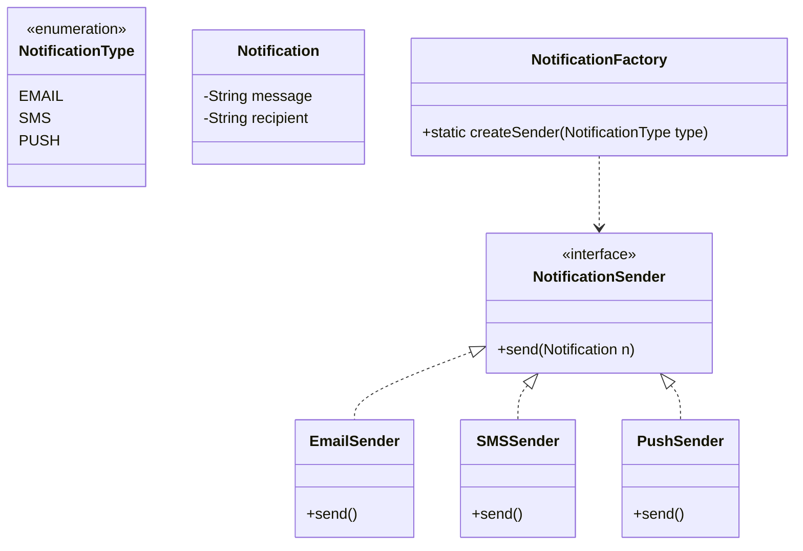

# Notification System UML

```mermaid
classDiagram
    class NotificationType {
        <<enumeration>>
        EMAIL
        SMS
        PUSH
    }

    class Notification {
        -String message
        -String recipient
    }

    class NotificationSender {
        <<interface>>
        +send(Notification n)
    }

    class EmailSender { +send() }
    class SMSSender { +send() }
    class PushSender { +send() }

    class NotificationFactory {
        +static createSender(NotificationType type)
    }

    NotificationSender <|.. EmailSender
    NotificationSender <|.. SMSSender
    NotificationSender <|.. PushSender
    NotificationFactory ..> NotificationSender
```
