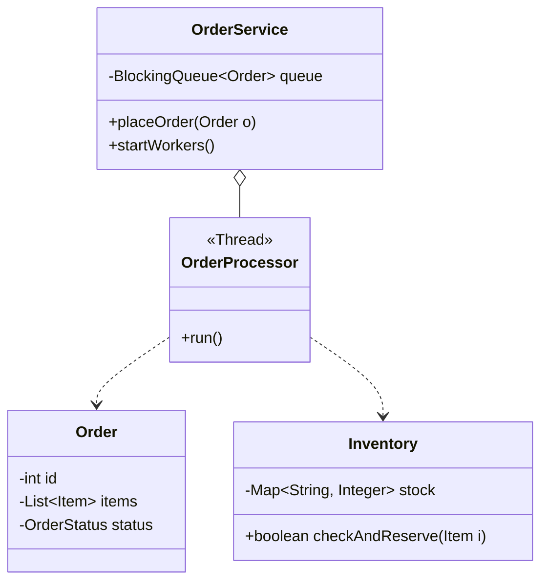

# Order Management System

## 1. Problem Statement & Company Tags

**Problem:** Design a system to handle high-volume Order Processing. It should support order placement, inventory checking, and asynchronous processing (Producer-Consumer).

**Company Tags:** `Amazon` `Wayfair` `Flipkart` `Walmart`

---

## 2. Requirement Clarification

### Functional Requirements

1.  **Place Order:** specific items and quantity.
2.  **Inventory Check:** Ensure stock exists.
3.  **Order Processing:** Payment, Shipping (Simulated).

### Non-Functional Requirements

1.  **Concurrency:** Multiple thousands of orders per second.
2.  **Decoupling:** UI thread shouldn't block on Payment/Shipping.

---

## 3. The Seniority Perspective

### SDE-1 Focus: Models

- **Focus:** `Order`, `OrderItem`, `User` classes.
- **Goal:** Basic CRUD for an order.

### SDE-2 Focus: State Machine

- **Focus:** Order Lifecycle.
- **States:** Created -> Pending -> PaymentProcessed -> Shipped -> Delivered.

### SDE-3 Focus: Producer-Consumer

- **Focus:** **Queue-Based Processing**.
- **Pattern:** **Producer-Consumer**.
  - API accepts order -> Pushes to `BlockingQueue`.
  - Worker Threads (Consumer) -> Poll queue -> Process Payment -> Update DB.
- **Why?** Handles bursts. If 10k users order at once, we don't crash; we just fill the queue.

---

## 4. Class Diagram

---

## 5. Trade-offs (SDE-3 Deep Dive)

| Decision                     | Option A                            | Option B                                 | Why we chose B?                                                                                                                                          |
| :--------------------------- | :---------------------------------- | :--------------------------------------- | :------------------------------------------------------------------------------------------------------------------------------------------------------- |
| **Processing Sync vs Async** | Process payment in API call (Sync). | Use Message Queue (Async).               | **Async**. Payment gateways are slow. Holding the HTTP connection open is bad. Queueing allows "Eventually Consistent" processing and higher throughput. |
| **Inventory Locking**        | `synchronized` block.               | Database Row Lock / `ConcurrentHashMap`. | **ConcurrentHashMap (for memory simulations)**. `synchronized` on the whole map is too slow. Fine-grained locking or atomic operations are needed.       |

---
## 6. Anti-Patterns (What NOT to do)
### ❌ 1. Inventory Oversell
*   **Bad:** Decrementing inventory after payment success.
*   **Why:** User pays, but item is gone. Bad UX.
*   **Fix:** Reserve inventory *temporarily* during checkout (TTL).

### ❌ 2. God 'Order' Object
*   **Bad:** Order object handling payment, shipping, and notification logic.
*   **Fix:** **Saga Pattern** or Event Driven Architecture.
