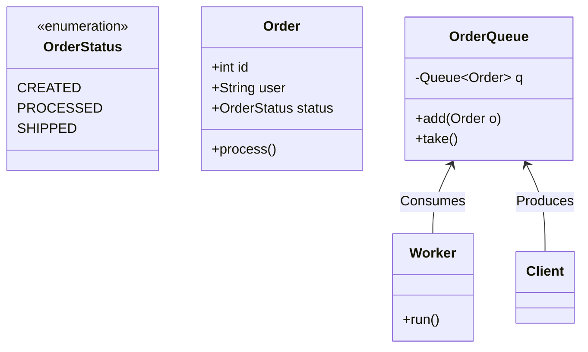

# Order Management System UML

```mermaid
classDiagram
    class OrderStatus {
        <<enumeration>>
        CREATED
        PROCESSED
        SHIPPED
    }

    class Order {
        +int id
        +String user
        +OrderStatus status
        +process()
    }

    class OrderQueue {
        -Queue~Order~ q
        +add(Order o)
        +take()
    }

    class Worker {
        +run()
    }

    OrderQueue <-- Worker : Consumes
    OrderQueue <-- Client : Produces
```
