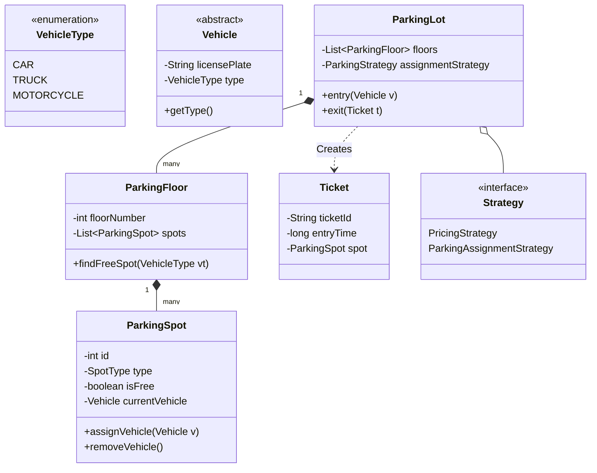

# Parking Lot Class Diagram

```mermaid
classDiagram
    class VehicleType {
        <<enumeration>>
        CAR
        TRUCK
        MOTORCYCLE
    }

    class Vehicle {
        <<abstract>>
        -String licensePlate
        -VehicleType type
        +getType()
    }

    class ParkingSpot {
        -int id
        -SpotType type
        -boolean isFree
        -Vehicle currentVehicle
        +assignVehicle(Vehicle v)
        +removeVehicle()
    }

    class ParkingFloor {
        -int floorNumber
        -List~ParkingSpot~ spots
        +findFreeSpot(VehicleType vt)
    }

    class ParkingLot {
        -List~ParkingFloor~ floors
        -ParkingStrategy assignmentStrategy
        +entry(Vehicle v)
        +exit(Ticket t)
    }

    class Ticket {
        -String ticketId
        -long entryTime
        -ParkingSpot spot
    }

    class Strategy {
        <<interface>>
        PricingStrategy
        ParkingAssignmentStrategy
    }

    ParkingLot "1" *-- "many" ParkingFloor
    ParkingFloor "1" *-- "many" ParkingSpot
    ParkingLot ..> Ticket : Creates
    ParkingLot o-- Strategy
```
