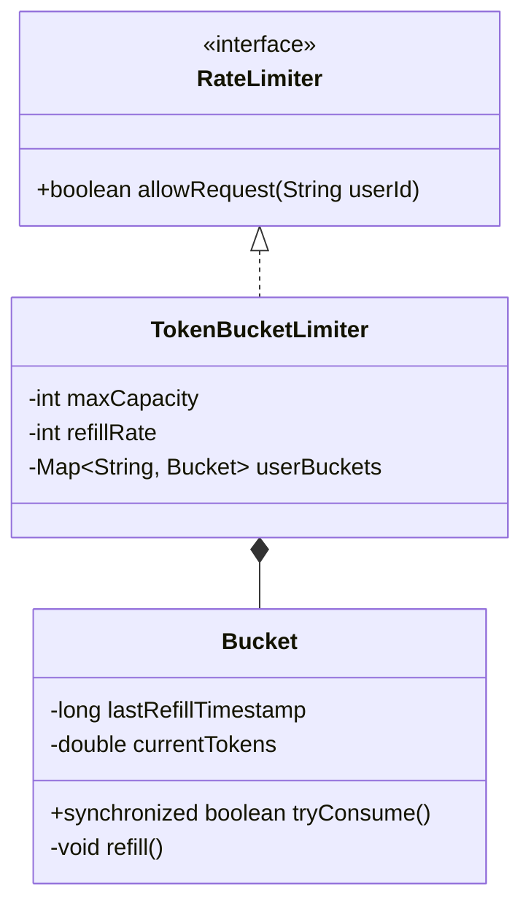

# Rate Limiter System

## 1. Problem Statement & Company Tags

**Problem:** Design a Rate Limiter that allows a user to perform `X` requests in `Y` seconds. If the user exceeds this limit, reject the request.

**Company Tags:** `Stripe` `Google` `Atlassian` `Amazon`

---

## 2. Requirement Clarification

### Functional Requirements

1.  **Limits:** Allow N requests per window (e.g., 10 req / 1 sec).
2.  **Granularity:** User-level, IP-level, or Global.
3.  **Algorithms:** Token Bucket or Sliding Window.

### Non-Functional Requirements

1.  **Latency:** Must be extremely low (< 1ms checks).
2.  **Concurrency:** Critical. Parallel requests should not breach the limit.

---

## 3. The Seniority Perspective

### SDE-1 Focus: Basic Logic

- **Focus:** Can you implement a simple counter?
- **Pitfall:** Resetting counter at fixed intervals (Fixed Window) causes "Spike at edges" issue.

### SDE-2 Focus: Algorithms

- **Focus:** Explain Token Bucket vs Leaky Bucket vs Sliding Window.
- **Implementation:** **Token Bucket** is standard for API rate limiting.

### SDE-3 Focus: Distributed vs Local

- **Focus:** How to handle this in a distributed system?
- **Local:** `AtomicInteger` or `synchronized` in memory.
- **Distributed:** Redis `INCR` + `EXPIRE` or Lua Script.
- **LLD Scope:** Implement the **Token Bucket** algorithm with thread safety.

---

## 4. Class Diagram

---

## 5. Trade-offs (SDE-3 Deep Dive)

| Decision            | Option A              | Option B      | Why we chose B?                                                                                                                        |
| :------------------ | :-------------------- | :------------ | :------------------------------------------------------------------------------------------------------------------------------------- |
| **Algorithm**       | Fixed Window Counter. | Token Bucket. | **Token Bucket**. Handles bursts gracefully and avoids the "double limit at boundary" issue of fixed windows.                          |
| **Refill Strategy** | Background Thread.    | Lazy Refill.  | **Lazy Refill**. We refill tokens only when a request comes in. This saves CPU resources (no background threads waking up constantly). |
