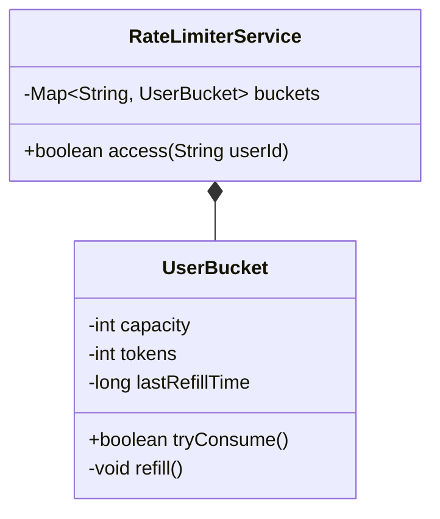

# Rate Limiter UML

```mermaid
classDiagram
    class RateLimiterService {
        -Map~String, UserBucket~ buckets
        +boolean access(String userId)
    }

    class UserBucket {
        -int capacity
        -int tokens
        -long lastRefillTime
        +boolean tryConsume()
        -void refill()
    }

    RateLimiterService *-- UserBucket
```
