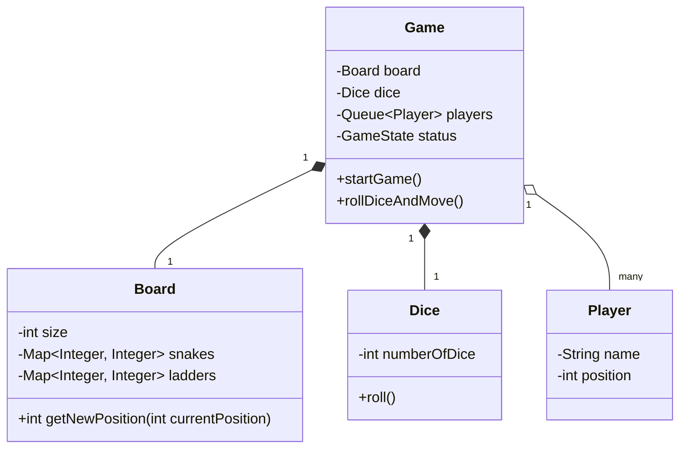

# Snake & Ladders Game

## 1. Problem Statement & Company Tags

**Problem:** Design the low-level architecture for a multiplayer Snake & Ladders game. The game should support a configurable board, dice, and players. The system must adhere to standard game rules and detect winning conditions.

**Company Tags:** `Amazon` `PhonePe` `Games24x7` `ShareChat`

---

## 2. Requirement Clarification

### Functional Requirements

1.  **Board:** Grid of cells (usually 100). Validates snakes (down) and ladders (up).
2.  **Dice:** Gives random number 1-6.
3.  **Players:** Multiple players take turns.
4.  **Movement:** Player moves strict position. Must verify "overshooting" 100 condition (only win on exact roll? or bounce?). _Assumption: Exact roll required or hold._
5.  **Game Loop:** Manage state, whose turn it is, and check winner.

### Non-Functional Requirements

1.  **Extensibility:** Support different board sizes or multiple dice.
2.  **Singleton:** Only one Game instance running per session.

---

## 3. The Seniority Perspective

### SDE-1 Focus: Object Modeling

- **Focus:** Core entities `Board`, `Snake`, `Ladder`, `Jumper`.
- **Encapsulation:** "Jumper" map (Start -> End).

### SDE-2 Focus: Design Patterns

- **Pattern:** **Factory Pattern** to create the Board elements (Random ly placing snakes/ladders).
- **Pattern:** **Singleton Pattern** for the `GameManager` or `Dice` (though Dice usually instanced).
- **Pattern:** **Strategy Pattern** for the "Winning Strategy" (Normal vs Fast mode?).

### SDE-3 Focus: Concurrency & Scale (if Online)

- **Focus:** How to handle state sync?
- **Design:** Observer pattern to notify UI/Clients of board updates.

---

## 4. Class Diagram

---

## 5. Core Logic Implementation

### Key Highlights

- **Jumper Logic:** We simplify Snakes and Ladders into a single concept: "Jump". A Map `Map<Start, End>` handles both.
  - If `End < Start` -> Snake.
  - If `End > Start` -> Ladder.
- **Game Loop:** A `while(!winner)` loop that polls players from a Queue and pushes them back if they haven't won.

---

## 6. Evaluation Against SOLID Principles

| Principle                 | Adherence in this Solution                                     |
| :------------------------ | :------------------------------------------------------------- |
| **S**ingle Responsibility | `Board` handles jumps, `Game` handles turns.                   |
| **O**pen/Closed           | Can subclass `Board` to make `ThreeDBoard` or `TeleportBoard`. |
| **L**iskov Substitution   | `SpecialDice` (e.g. Crooked) can replace `Dice`.               |

---
## 6. Anti-Patterns (What NOT to do)
### ❌ 1. Hardcoded Board
*   **Bad:** if (pos == 99) goto 10
*   **Why:** Can't change board layout.
*   **Fix:** Map of Jump Entities (Start -> End).

### ❌ 2. Singleton Game
*   **Bad:** Formatting the game as a static class.
*   **Why:** Cannot run multiple games (e.g., tournament).
*   **Fix:** Game instance per session.
