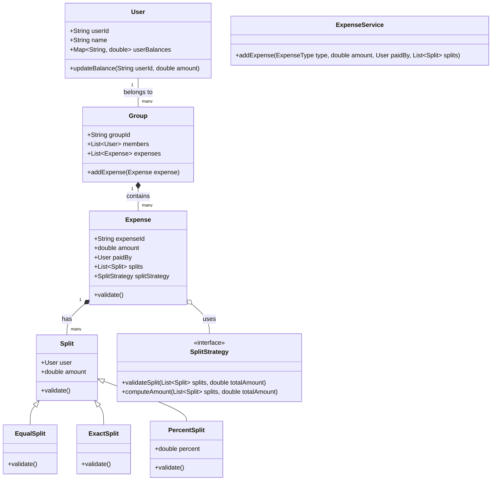

# Splitwise (Expense Sharing Application)

## 1. Problem Statement & Company Tags

**Problem:** Design an expense sharing application (like Splitwise) where users can add expenses, split them among a group of people, and track balances. The system should allow keeping track of who owes whom and simplify debts where possible.

**Company Tags:** `Amazon` `Flipkart` `Uber` `Microsoft` `Swiggy`

---

## 2. Requirement Clarification

### Functional Requirements

1.  **User Management:** detailed user profiles are not required, but strict User IDs are necessary.
2.  **Groups:** Users can create groups and add other users to them.
3.  **Add Expense:** Users can add expenses within a group or directly with another user.
    - Support different split types: **Equal**, **Exact**, and **Percentage**.
4.  **View Balances:** Users can see their total balance (owed/owing) and specific balances with others.
5.  **Simplify Debt (Optional/SDE-3):** The system should minimize the number of transactions needed to settle debts.

### Non-Functional Requirements

1.  **Concurrency:** Multiple users might add expenses to the same group simultaneously. Balances must be updated atomically.
2.  **Scalability:** The system should handle millions of users and expenses (though for LLD, we focus on class extensibility).
3.  **Precision:** Financial calculations must be precise (avoid floating-point errors).
4.  **Extensibility:** Easy to add new split strategies in the future.

---

## 3. The Seniority Perspective

### SDE-1 Focus: Clean Code & Basics

- **Focus:** Creating clean entities (`User`, `Expense`, `Group`).
- **Goal:** Ensure users can add basic expenses and valid inputs are checked.
- **Anti-Pattern:** putting all split logic (Equal/Exact/Percent) in a single huge `if-else` block inside the `Expense` class.

### SDE-2 Focus: Design Patterns & Extensibility

- **Focus:** Decoupling the "Split Logic" from the "Expense" entity.
- **Pattern:** Use the **Strategy Pattern** for `SplitStrategy`. This allows adding `SharesSplit` or `AdjustmentSplit` later without touching the core Expense logic.
- **Pattern:** Use the **Factory Pattern** to create the appropriate Split strategy based on user input.

### SDE-3 Focus: Concurrency & Optimization

- **Focus:** What happens if User A adds an expense and User B adds an expense to the same group at the same millisecond?
- **Solution:** Simple locking on the `User` balance sheet is not enough if there are circular dependencies. We might need a `Group` level lock or optimistic locking.
- **Optimization:** **Debt Simplification**. If A owes B $10, and B owes C $10, the system should simplify this to A owes C $10. This is a graph simplification problem.

---

## 4. Class Diagram

---

## 5. Core Logic Implementation

The implementation is provided in the `src/` directory.

### Key Highlights

- **Strategy Pattern:** `ExpenseSplitValidation` interface (or abstract class) to handle different validation logic.
- **Concurrency:** `ReentrantReadWriteLock` used in `User` class to ensure thread-safe balance updates.

### [View Code Structure](./src/)

---

## 6. Evaluation Against SOLID Principles

| Principle                 | Adherence in this Solution                                                                                                                                       |
| :------------------------ | :--------------------------------------------------------------------------------------------------------------------------------------------------------------- |
| **S**ingle Responsibility | `User` manages profile, `Expense` manages transaction details, `SplitStrategy` manages math. Separation is clear.                                                |
| **O**pen/Closed           | We can add a `SharesSplit` strategy without modifying the `ExpenseService` or `Expense` class.                                                                   |
| **L**iskov Substitution   | `EqualSplit`, `ExactSplit` can be used interchangeably wherever `Split` is expected.                                                                             |
| **I**nterface Segregation | We use focused interfaces for Strategies.                                                                                                                        |
| **D**ependency Inversion  | High-level `ExpenseService` depends on the abstraction `SplitStrategy`, not concrete implementations like `EqualSplitStrategy` directly (via Factory/Injection). |

---
## 6. Anti-Patterns (What NOT to do)
### ❌ 1. Floating Point Money
*   **Bad:** double amount = 10.0 / 3;
*   **Why:** Precision errors (.33333). Money vanishes.
*   **Fix:** Use BigDecimal and rounding modes.

### ❌ 2. Graph Complexity
*   **Bad:** Solving 'Simplify Debt' with N! brute force.
*   **Why:** Crashes with >10 users.
*   **Fix:** Use greedy algorithms or Flow Network (Max Flow/Min Cut) approximations.
