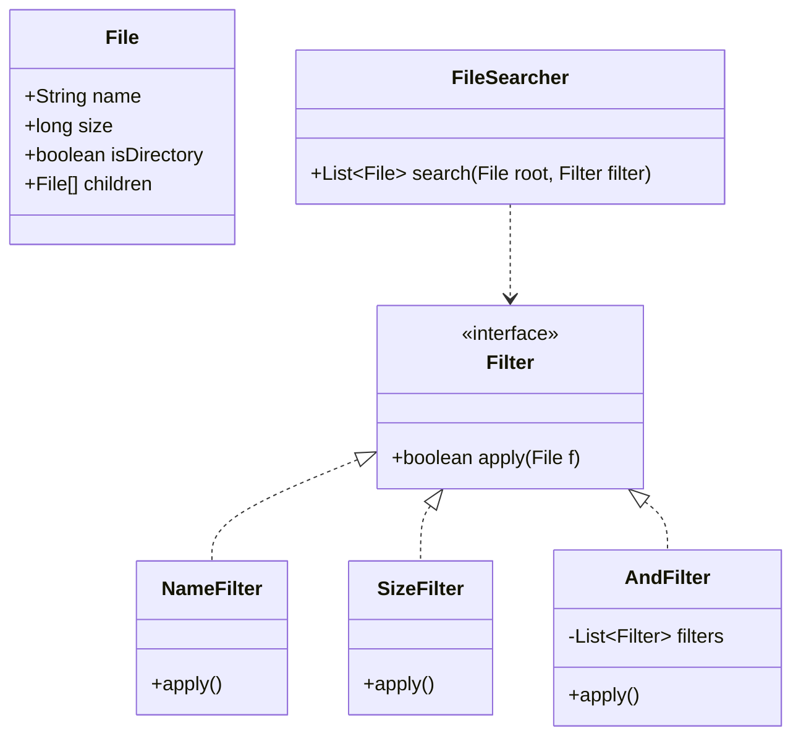

# Unix "Find" Command

## 1. Problem Statement & Company Tags

**Problem:** Design the Unix/Linux `find` command. It searches a directory hierarchy for files matching specific criteria (Name, Size, Extension). It must support boolean operators (AND, OR).

**Company Tags:** `Amazon` `Google`

---

## 2. Requirement Clarification

### Functional Requirements

1.  **Search:** Recursive search in directory.
2.  **Filters:**
    - `MinSize` / `MaxSize`
    - `Name` (contains string)
    - `Extension` (e.g., .xml)
3.  **Operators:** `AND`, `OR` to combine filters.

### Non-Functional Requirements

1.  **Extensibility:** Easy to add "DateModified" filter.
2.  **Maintainability:** Avoid massive if-else chains.

---

## 3. The Seniority Perspective

### SDE-1 Focus: Recursion

- **Focus:** Can you write a recursive DFS?
- **Goal:** Iterate through nested folders.

### SDE-2 Focus: Specification Pattern

- **Focus:** Decoupling Traversal from Filtering.
- **Pattern:** **Specification Pattern** or **Composite Pattern**.
  - `FileFilter` interface with `apply(File)`.
  - `AndFilter`, `OrFilter` combine other filters.
- **Why?** "if (size > 5 && name.contains("foo"))" is hard-coded. Specifications allow dynamic query building.

### SDE-3 Focus: Streaming

- **Focus:** Large file systems.
- **Optimization:** Return a `Stream<File>` or `Iterator` instead of loading all results into a `List`.
- **Symlinks:** Handle cycles.

---

## 4. Class Diagram

---

## 5. Trade-offs (SDE-3 Deep Dive)

| Decision            | Option A                                 | Option B                   | Why we chose B?                                                                                                                                           |
| :------------------ | :--------------------------------------- | :------------------------- | :-------------------------------------------------------------------------------------------------------------------------------------------------------- |
| **Logic structure** | Monolithic `search()` method with flags. | **Specification Pattern**. | **Specification Pattern**. It allows us to build complex queries like `(Size > 5MB OR Name="*.log") AND (Date < Today)`. Option A explodes in complexity. |
| **Traversal**       | Recursive DFS.                           | BFS with Queue.            | **DFS**. Standard for file systems. Simpler code for an interview. BFS is better if ensuring "shallowest file first" is a requirement.                    |
