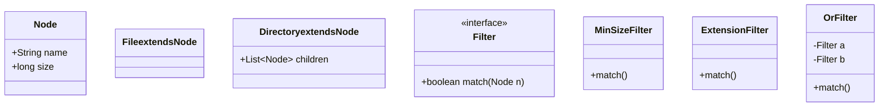

# Unix Find UML

```mermaid
classDiagram
    class Node {
        +String name
        +long size
    }

    class File extends Node
    class Directory extends Node {
        +List~Node~ children
    }

    class Filter {
        <<interface>>
        +boolean match(Node n)
    }

    class MinSizeFilter { +match() }
    class ExtensionFilter { +match() }

    class OrFilter {
        -Filter a
        -Filter b
        +match()
    }
```
