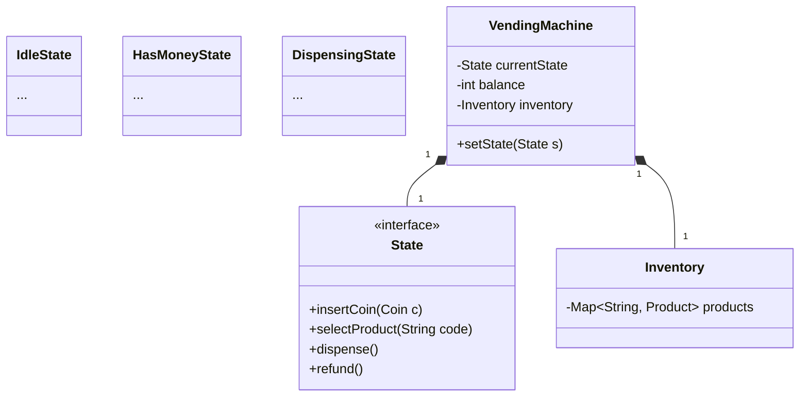

# Vending Machine System

## 1. Problem Statement & Company Tags

**Problem:** Design a Vending Machine that accepts coins/notes, allows users to select products, dispenses the product, and returns change. The system must handle state transitions (e.g., Idle -> Money Inserted -> Selection -> Dispense) robustly.

**Company Tags:** `Google` `Walmart` `Amazon`

---

## 2. Requirement Clarification

### Functional Requirements

1.  **Payment:** Accept Coins (1, 5, 10, 25).
2.  **Product Selection:** User enters code (e.g., A1, B2).
3.  **Dispense:** Dispense item if sufficient balance.
4.  **Change:** Return remaining balance.
5.  **Refund:** Allow cancellation.

### Non-Functional Requirements

1.  **State Management:** Machine should not allow selection before money, or refund during dispensing.
2.  **Inventory:** Track stock.

---

## 3. The Seniority Perspective

### SDE-1 Focus: Entities

- **Focus:** `Product`, `Coin`, `VendingMachine` class.
- **Goal:** Basic if-else logic for flow.

### SDE-2 Focus: State Pattern

- **Focus:** Managing complex transitions.
- **Pattern:** **State Pattern**.
  - `VendingMachineState` interface.
  - `IdleState`, `HasMoneyState`, `DispensingState`.
- **Why?** "if-else" becomes unmanageable with Refund, Inventory Empty, Insufficient Money cases.

### SDE-3 Focus: Maintenance & Hardware

- **Focus:** What if the rack is jammed?
- **Design:** `MaintenanceState`, Hardware Exceptions, Singleton for the Machine logic.

---

## 4. Class Diagram

---

## 5. Trade-offs (SDE-3 Deep Dive)

| Decision        | Option A                               | Option B                       | Why we chose B?                                                                                                                          |
| :-------------- | :------------------------------------- | :----------------------------- | :--------------------------------------------------------------------------------------------------------------------------------------- |
| **State Logic** | Big `switch-case` in `VendingMachine`. | **State Pattern** (Classes).   | **State Pattern**. It adheres to Open/Closed principle. Adding a new state (e.g. "Maintenance") doesn't break existing code.             |
| **Concurrency** | `synchronized` methods.                | `AtomicInteger` for inventory. | **Synchronized**. Since it's a physical machine, only one user interacts at a time. Concurrency is less critical than state correctness. |

---

## 6. Anti-Patterns (What NOT to do)

### ❌ 1. The 'Switch' Statement Hell
*   **Bad:** Using a giant switch(state) inside every method (insertCoin, selectProduct).
*   **Why:** Adding a new state (e.g., Maintenance) requires modifying *every* method. High risk of bugs.
*   **Fix:** **State Pattern**. Each state is a class (IdleState, HasMoneyState). Transitions are encapsulated.

### ❌ 2. Returning Change in a Loop
*   **Bad:** while (balance > 0) dispenseCoin();
*   **Why:** If the hardware fails halfway, the user loses money or the machine state is corrupt.
*   **Fix:** Calculate the entire change set *first*, determine if it's possible, *then* dispense. Transactional integrity.
