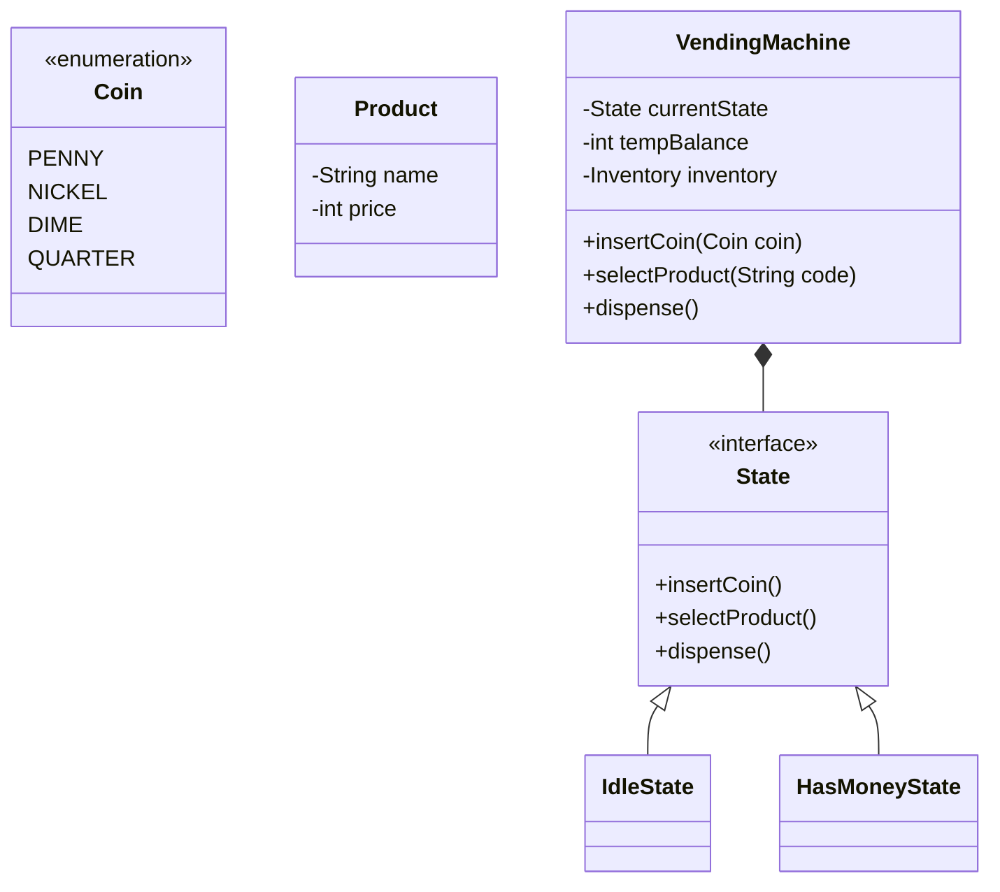

# Vending Machine UML

```mermaid
classDiagram
    class Coin {
        <<enumeration>>
        PENNY
        NICKEL
        DIME
        QUARTER
    }

    class Product {
        -String name
        -int price
    }

    class VendingMachine {
        -State currentState
        -int tempBalance
        -Inventory inventory
        +insertCoin(Coin coin)
        +selectProduct(String code)
        +dispense()
    }

    class State {
        <<interface>>
        +insertCoin()
        +selectProduct()
        +dispense()
    }

    VendingMachine *-- State
    State <|-- IdleState
    State <|-- HasMoneyState
```
